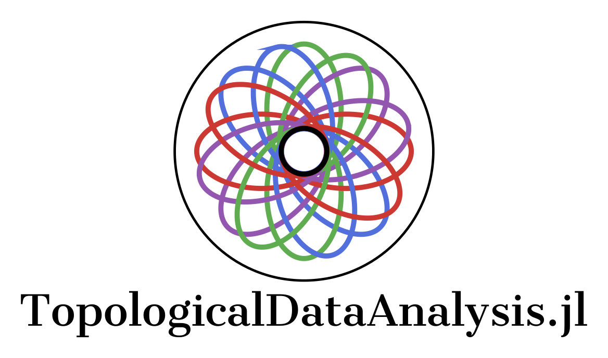

  

<!--  -->
<!-- # TopologicalDataAnalysis.jl -->

[![Build Status][gha-img]][gha-url]
[![][bag-dev]][bld-dev]

<!-- [![][bag-stb]][bld-stb] -->
<!--  -->

This package provides some [Julia](https://julialang.org/) implementations
for Topological Data Analysis, inspired by
[Velour](https://github.com/raphaeltinarrage/velour/blob/main/velour) package.

More to come.

## Desired Features
- [x] Pending;

[gha-img]: https://github.com/davibarreira/TopologicalDataAnalysis.jl/actions/workflows/Documentation.yml/badge.svg
[gha-url]: https://github.com/davibarreira/TopologicalDataAnalysis.jl/actions?query=workflow%3ACI
[bag-dev]: https://img.shields.io/badge/docs-dev-blue.svg
[bld-dev]: https://github.com/davibarreira/TopologicalDataAnalysis.jl/dev
<!-- [bag-stb]: https://img.shields.io/badge/docs-stable-blue.svg -->
<!-- [bld-stb]: https://juliagraphs.org/VegaGraphs.jl/stable -->
